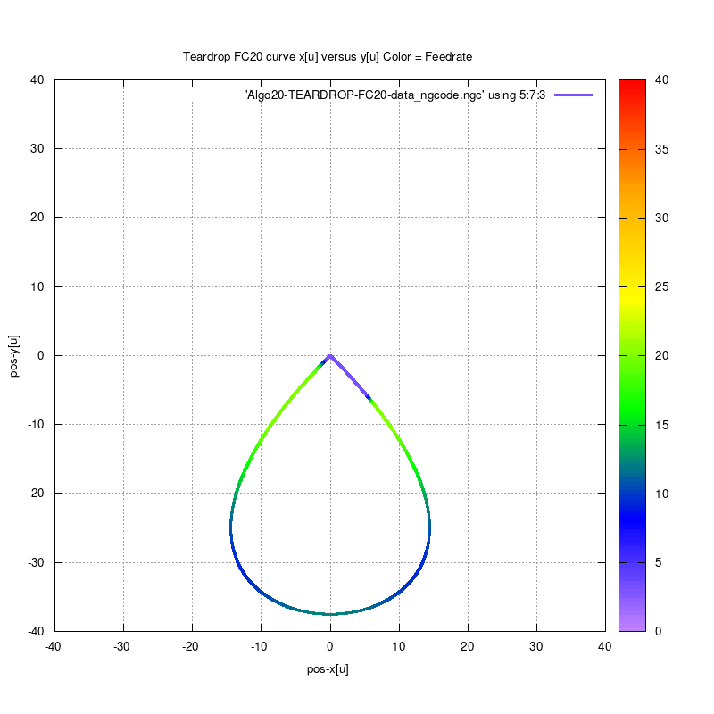
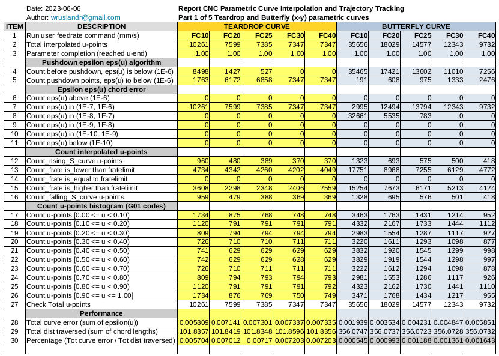

# TEARDROP-parametric-curve
TEARDROP C-codes to generate NGC for CNC milling

# The four(4) contributions to the Feedrate Limit

# Current feedrate = minimum of feedrate limits

# Feedrate run profile for command feedrate = FC20

# Run data for command feedrates (FC10,FC20,FC25,FC30,FC40)

Wassalam.
WRY
